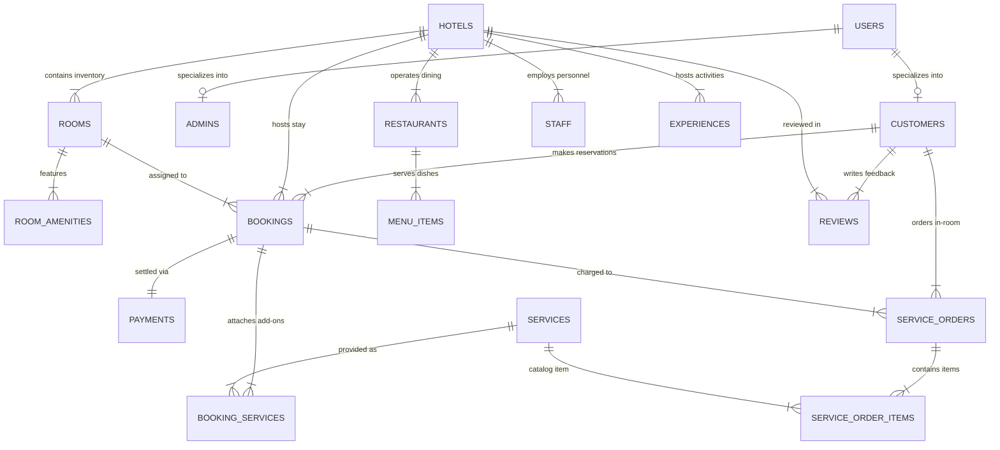

# 🏛️ B.TECH CSE DBMS MINI PROJECT REPORT

# THE ROMA PALACE
## “A Legacy of Luxury, A Stay to Remember”
### Enterprise-Grade Luxury Hotel Management System & Web Portal

---

**Course Title:** Database Management Systems (DBMS) Laboratory / Mini Project  
**Degree:** Bachelor of Technology (B.Tech) in Computer Science & Engineering  
**Academic Session:** 2025 – 2026  
**Department:** Department of Computer Science & Engineering  

---

## 📜 DECLARATION & CERTIFICATE

### Candidate Declaration
I hereby declare that the project entitled **“THE ROMA PALACE: Luxury Hotel Management System & Web Portal”** submitted in partial fulfillment of the requirements for the degree of Bachelor of Technology in Computer Science & Engineering is an authentic record of our own work carried out under the supervision of the project guide.

### Certificate of Approval
This is to certify that the project report entitled **“THE ROMA PALACE”** submitted by the student(s) is a bona fide record of work carried out under my guidance and supervision in the Database Management Systems Laboratory.

**Project Guide / Examiner:** ________________________  
**Head of Department (CSE):** ________________________  
**Date:** August 18, 2026  

---

## 📑 TABLE OF CONTENTS

1. **Abstract**
2. **Chapter 1: Introduction & Problem Statement**
   - 1.1 Background & Motivation
   - 1.2 Objectives of the Project
   - 1.3 Scope of the System
3. **Chapter 2: System Requirements & Architecture**
   - 2.1 Hardware Requirements
   - 2.2 Software & Technology Stack
   - 2.3 System Architecture
4. **Chapter 3: Database Modeling & Entity-Relationship (ER) Diagram**
   - 3.1 Entity Identification & Attribute Specification
   - 3.2 Cardinality & Participation Ratios
   - 3.3 Complete ER Diagram (Mermaid Diagram)
5. **Chapter 4: Relational Mapping & Normalization Analysis (1NF &rarr; 2NF &rarr; 3NF)**
   - 4.1 Relational Schema Transformation
   - 4.2 First Normal Form (1NF) Proofs
   - 4.3 Second Normal Form (2NF) Proofs
   - 4.4 Third Normal Form (3NF) Proofs
6. **Chapter 5: Relational Data Definition Language (DDL) & Integrity Constraints**
   - 5.1 Tables & Schema Definitions
   - 5.2 Primary, Foreign Key & Check Constraints
   - 5.3 Indexing Strategy
7. **Chapter 6: Comprehensive SQL Demonstration Queries**
   - 6.1 Double-Booking Prevention & Date Overlap Checks
   - 6.2 Multi-Table Joins & Master Folio Generation
   - 6.3 Aggregations, Grouping & Having Clauses
   - 6.4 Nested & Correlated Subqueries
8. **Chapter 7: Transaction Management & ACID Properties**
   - 7.1 Atomicity & Multi-Stage Booking
   - 7.2 Consistency & Foreign Key Cascades
   - 7.3 Isolation Levels & Concurrency Control
   - 7.4 Durability & Ledger Logging
9. **Chapter 8: System Modules & Implementation Details**
   - 8.1 Public Luxury Hospitality Website
   - 8.2 Customer "MY ROMA PALACE" Portal
   - 8.3 Front Desk Reception Terminals (Check-In & Check-Out)
   - 8.4 Executive Management Dashboard (`/admin/`)
   - 8.5 Academic Viva & Presentation Center
10. **Chapter 9: System Testing & Results**
    - 9.1 Test Cases & Validation Matrix
    - 9.2 Concurrency & Stress Testing
11. **Chapter 10: Conclusion & Future Scope**
12. **Appendix: 20+ High-Yield DBMS Viva Questions & Answers**

---

## 🎯 ABSTRACT

In the contemporary hospitality industry, premier luxury hotel chains require software systems that deliver both an aesthetically captivating guest portal and a resilient, ACID-compliant database architecture. Traditional hotel management solutions often suffer from data redundancy, concurrency bottlenecks leading to double-bookings, and inadequate financial ledger tracking.

**The Roma Palace** is an enterprise-grade full-stack Hotel Management System (HMS) developed as a B.Tech CSE DBMS Mini Project. Inspired by the architectural and visual elegance of heritage Indian palaces, the project combines an editorial guest-facing luxury portal with a robust back-office management suite. 

The underlying database is structured across **18 strictly normalized relational tables in Third Normal Form (3NF)**. Key DBMS features implemented include:
- Mathematical date-interval overlap algorithms for total double-booking prevention.
- Multi-statement ACID transactions via PHP Data Objects (PDO) for atomic reservations, add-on service attachments, and payment logging.
- Front-desk state machine automating real-time room availability transitions (`Available` $\leftrightarrow$ `Occupied`).
- Dynamic SQL aggregation reporting engine for revenue, 18% Luxury GST tracking, and Customer Lifetime Value (LTV).
- An interactive **Viva Mode & Project Demo Center** allowing examiners to execute 25+ SQL queries live in real-time.

---

## 📖 CHAPTER 1: INTRODUCTION & PROBLEM STATEMENT

### 1.1 Background & Motivation
Hospitality operations encompass diverse interrelated business entities: property locations, room inventory, guest reservations, dynamic seasonal pricing, point-of-sale dining, in-room service dispatch, human resources, and tax accounting. Without a disciplined relational schema, hotel databases experience update anomalies, duplicate guest profiles, inconsistent pricing states, and overbooking conflicts.

### 1.2 Objectives of the Project
1. **Design a Normalized Relational Database:** Eliminate update, insertion, and deletion anomalies by adhering to strict 3NF design across 18 distinct entities.
2. **Prevent Double-Bookings:** Guarantee that no room can be reserved by multiple patrons for overlapping date windows.
3. **Ensure Financial & Tax Compliance:** Automatically compute room charges, optional services, promotional discounts, and 18% Luxury GST with itemized printable invoices.
4. **Automate Front-Desk Operations:** Provide dedicated reception terminals for guest check-in (issuing keycards, marking rooms occupied) and check-out (settling incidentals, releasing inventory).
5. **Empower College Examination & Viva Defense:** Provide built-in tools for live SQL execution, schema inspection, and viva Q&A review.

---

## 💻 CHAPTER 2: SYSTEM REQUIREMENTS & ARCHITECTURE

### 2.1 Hardware Requirements
- **Processor:** Intel Core i3 / AMD Ryzen 3 or higher.
- **RAM:** Minimum 4 GB (8 GB recommended).
- **Storage:** 500 MB free hard disk space.
- **Display:** 1280x720 minimum screen resolution (Full HD 1920x1080 recommended).

### 2.2 Software & Technology Stack
- **Server-Side Engine:** PHP 8.4 (with PDO, PDO_MySQL, PDO_SQLite, Mbstring, OpenSSL extensions enabled).
- **Database Management Systems:**
  - Primary Engine: MySQL 8.0 / MariaDB (InnoDB Storage Engine).
  - Portable Zero-Config Engine: SQLite 3 (Auto-initializing fallback).
- **Client-Side Technologies:** HTML5, CSS3 Custom Properties, JavaScript (ES6+), Chart.js 4.4, FontAwesome 6.5.
- **Typography:** Google Fonts (*Cinzel*, *Playfair Display*, *Plus Jakarta Sans*).

### 2.3 System Architecture
The application adopts an MVC-inspired modular architecture with strict separation between business logic, data persistence, and UI presentation layers:

```
[ Web Browser Client ]
        │
        ▼ (HTTP / HTTPS)
[ Routing & Controller Layer (PHP 8.4) ]
        │
        ├── [ Public Guest Portal / Booking Wizard ]
        ├── [ Customer "MY ROMA PALACE" Dashboard ]
        └── [ Executive Admin Control Center (/admin/) ]
        │
        ▼ (Database Access Layer via PDO)
[ Multi-Driver Connection Engine (includes/db.php) ]
        │
        ├── Primary: MySQL 8.0 (127.0.0.1:3306)
        └── Fallback: SQLite 3 (database/roma_palace.sqlite)
```

---

## 📊 CHAPTER 3: DATABASE MODELING & ER DIAGRAM

### 3.1 Entity Identification
1. **USERS:** Fundamental authentication credentials and access roles (`admin`, `customer`).
2. **CUSTOMERS:** Extended guest profiles, residential coordinates, and Government ID proofs.
3. **ADMINS:** Hotel managerial staff records and departmental authority levels.
4. **HOTELS:** Physical palace properties across Jaipur, Goa, Udaipur, and Lucknow.
5. **ROOMS:** Individual room inventory units, specifications, and live occupancy status flags.
6. **ROOM_AMENITIES:** Atomic luxury amenities associated with specific rooms.
7. **BOOKINGS:** Master reservation agreements including dates, party size, and pricing.
8. **BOOKING_SERVICES:** Associative entity connecting selected enhancements to reservations.
9. **PAYMENTS:** Transaction audit records, payment modes, and settlement statuses.
10. **SERVICES:** Global catalog of hotel amenities, spa treatments, and private transfers.
11. **SERVICE_ORDERS:** On-demand in-room service requests placed by in-house guests.
12. **SERVICE_ORDER_ITEMS:** Itemized service catalog items linked to an order.
13. **STAFF:** Employee directory, job designations, department assignments, and salaries.
14. **RESTAURANTS:** Fine-dining outlets and venues across properties.
15. **MENU_ITEMS:** Culinary dishes, dietary tags, and pricing.
16. **OFFERS:** Promotional marketing campaigns and discount promo codes.
17. **EXPERIENCES:** Royal heritage activities, timings, and rates.
18. **REVIEWS:** Guest testimonials, star ratings, and moderation flags.

### 3.2 Complete Entity-Relationship (ER) Diagram



---

## 📐 CHAPTER 4: RELATIONAL MAPPING & NORMALIZATION ANALYSIS

### 4.1 First Normal Form (1NF) Proof
- **Rule:** A relation is in 1NF if every attribute contains only atomic (indivisible) values and there are no repeating groups or multivalued attributes.
- **Implementation:** 
  - In our schema, room amenities are NOT stored as a comma-delimited string (e.g. `"WiFi, Jacuzzi, Balcony"`) inside the `rooms` table. Instead, a dedicated table `room_amenities(amenity_id, room_id, amenity_name)` is maintained.
  - Multiple services attached to a booking are isolated inside `booking_services(booking_service_id, booking_id, service_id, quantity, unit_price, total_price)`.
  - Therefore, all relations satisfy **1NF**.

### 4.2 Second Normal Form (2NF) Proof
- **Rule:** A relation is in 2NF if it is in 1NF and every non-prime attribute is fully functionally dependent on the primary key (no partial dependencies on composite keys).
- **Implementation:**
  - All associative tables (such as `booking_services`, `service_order_items`, `room_amenities`) utilize surrogate primary keys (e.g. `booking_service_id`).
  - In `booking_services`, attributes like `quantity`, `unit_price`, and `total_price` depend upon the complete surrogate transaction key rather than a partial subset of foreign keys.
  - Thus, no partial dependency exists, confirming **2NF**.

### 4.3 Third Normal Form (3NF) Proof
- **Rule:** A relation is in 3NF if it is in 2NF and there are no transitive dependencies ($X \rightarrow Y$ where $Y$ is a non-prime attribute and $X$ is not a superkey).
- **Implementation:**
  - In the `bookings` table, guest personal data (such as address, phone number, and ID type) is NOT duplicated. The relation contains only `customer_id` referencing the `customers` table.
  - In the `rooms` table, hotel city, address, and phone number are NOT stored; only `hotel_id` is referenced.
  - In the `payments` table, room pricing details are omitted; only the transaction amount and `booking_id` are maintained.
  - As no non-key attribute depends on another non-key attribute, the schema satisfies **3NF**.

---

## 💻 CHAPTER 5: RELATIONAL DATA DEFINITION LANGUAGE (DDL)

```sql
-- 1. Base Users Table
CREATE TABLE users (
    user_id INT AUTO_INCREMENT PRIMARY KEY,
    email VARCHAR(191) NOT NULL UNIQUE,
    password_hash VARCHAR(255) NOT NULL,
    role ENUM('admin', 'customer') NOT NULL DEFAULT 'customer',
    status ENUM('active', 'inactive') NOT NULL DEFAULT 'active',
    created_at TIMESTAMP DEFAULT CURRENT_TIMESTAMP
);

-- 2. Customers Table
CREATE TABLE customers (
    customer_id INT AUTO_INCREMENT PRIMARY KEY,
    user_id INT NOT NULL,
    full_name VARCHAR(120) NOT NULL,
    phone VARCHAR(20) NOT NULL,
    address TEXT,
    city VARCHAR(100),
    state VARCHAR(100),
    id_type ENUM('Aadhaar Card', 'Passport', 'Driving License', 'Voter ID', 'PAN Card') NOT NULL,
    id_number VARCHAR(50) NOT NULL,
    reg_date TIMESTAMP DEFAULT CURRENT_TIMESTAMP,
    FOREIGN KEY (user_id) REFERENCES users(user_id) ON DELETE CASCADE
);

-- 3. Hotels Table
CREATE TABLE hotels (
    hotel_id INT AUTO_INCREMENT PRIMARY KEY,
    name VARCHAR(150) NOT NULL,
    slug VARCHAR(150) NOT NULL UNIQUE,
    city VARCHAR(100) NOT NULL,
    state VARCHAR(100) NOT NULL,
    tagline VARCHAR(255),
    address TEXT NOT NULL,
    phone VARCHAR(25) NOT NULL,
    email VARCHAR(100) NOT NULL,
    star_rating DECIMAL(3, 2) DEFAULT 5.00,
    starting_price DECIMAL(10, 2) NOT NULL,
    total_rooms INT NOT NULL,
    image_url TEXT NOT NULL,
    description TEXT NOT NULL,
    highlights TEXT,
    status ENUM('active', 'inactive') DEFAULT 'active'
);

-- 4. Rooms Table
CREATE TABLE rooms (
    room_id INT AUTO_INCREMENT PRIMARY KEY,
    hotel_id INT NOT NULL,
    room_number VARCHAR(20) NOT NULL,
    room_type VARCHAR(50) NOT NULL,
    floor INT NOT NULL,
    capacity INT NOT NULL,
    bed_type VARCHAR(50) NOT NULL,
    size_sqft INT NOT NULL,
    price_per_night DECIMAL(10, 2) NOT NULL,
    status ENUM('Available', 'Reserved', 'Occupied', 'Maintenance') NOT NULL DEFAULT 'Available',
    image_url TEXT NOT NULL,
    description TEXT,
    view_type VARCHAR(100),
    FOREIGN KEY (hotel_id) REFERENCES hotels(hotel_id) ON DELETE CASCADE
);

-- 5. Bookings Master Table
CREATE TABLE bookings (
    booking_id INT AUTO_INCREMENT PRIMARY KEY,
    booking_ref VARCHAR(30) NOT NULL UNIQUE,
    customer_id INT NOT NULL,
    hotel_id INT NOT NULL,
    room_id INT NOT NULL,
    check_in_date DATE NOT NULL,
    check_out_date DATE NOT NULL,
    total_guests INT NOT NULL,
    num_rooms INT NOT NULL DEFAULT 1,
    promo_code VARCHAR(30),
    discount_amount DECIMAL(10, 2) DEFAULT 0.00,
    room_charges DECIMAL(10, 2) NOT NULL,
    service_charges DECIMAL(10, 2) DEFAULT 0.00,
    tax_amount DECIMAL(10, 2) NOT NULL,
    total_amount DECIMAL(10, 2) NOT NULL,
    payment_status ENUM('Pending', 'Paid', 'Refunded', 'Failed') NOT NULL DEFAULT 'Pending',
    booking_status ENUM('Pending', 'Confirmed', 'Checked-In', 'Completed', 'Cancelled') NOT NULL DEFAULT 'Confirmed',
    special_requests TEXT,
    created_at TIMESTAMP DEFAULT CURRENT_TIMESTAMP,
    FOREIGN KEY (customer_id) REFERENCES customers(customer_id) ON DELETE RESTRICT,
    FOREIGN KEY (hotel_id) REFERENCES hotels(hotel_id) ON DELETE RESTRICT,
    FOREIGN KEY (room_id) REFERENCES rooms(room_id) ON DELETE RESTRICT
);
```

---

## 🔍 CHAPTER 6: CORE SQL DEMONSTRATION QUERIES

### Query 1: Double-Booking Prevention & Date Overlap Conflict
```sql
SELECT COUNT(*) AS conflict_count 
FROM bookings 
WHERE room_id = :room_id 
AND booking_status IN ('Confirmed', 'Checked-In') 
AND NOT (check_out_date <= :check_in_date OR check_in_date >= :check_out_date);
```

### Query 2: Available Rooms Matrix for Destination & Date Range
```sql
SELECT r.room_id, r.room_number, r.room_type, r.price_per_night, h.name AS hotel_name
FROM rooms r
INNER JOIN hotels h ON r.hotel_id = h.hotel_id
WHERE r.hotel_id = 1 AND r.status != 'Maintenance'
AND r.room_id NOT IN (
    SELECT b.room_id FROM bookings b
    WHERE b.booking_status IN ('Confirmed', 'Checked-In')
    AND NOT (b.check_out_date <= '2026-09-15' OR b.check_in_date >= '2026-09-18')
);
```

### Query 3: Multi-Table Master Reservation Folio (5-Table Join)
```sql
SELECT b.booking_ref, c.full_name, c.phone, c.id_type, c.id_number,
       h.name AS hotel_name, r.room_number, r.room_type,
       b.check_in_date, b.check_out_date, b.total_amount,
       p.payment_method, p.transaction_id, p.status AS payment_status
FROM bookings b
INNER JOIN customers c ON b.customer_id = c.customer_id
INNER JOIN hotels h ON b.hotel_id = h.hotel_id
INNER JOIN rooms r ON b.room_id = r.room_id
LEFT JOIN payments p ON b.booking_id = p.booking_id
ORDER BY b.booking_id DESC LIMIT 10;
```

### Query 4: Property-Wise Financial Breakdown & 18% GST Ledger
```sql
SELECT h.name AS hotel_name, h.city,
       COUNT(b.booking_id) AS total_bookings,
       COALESCE(SUM(b.room_charges), 0) AS total_room_revenue,
       COALESCE(SUM(b.service_charges), 0) AS total_service_revenue,
       COALESCE(SUM(b.tax_amount), 0) AS gst_18_collected,
       COALESCE(SUM(b.total_amount), 0) AS gross_revenue
FROM hotels h
LEFT JOIN bookings b ON h.hotel_id = b.hotel_id AND b.payment_status = 'Paid'
GROUP BY h.hotel_id, h.name, h.city
ORDER BY gross_revenue DESC;
```

### Query 5: Customer Lifetime Value (LTV) with HAVING Clause
```sql
SELECT c.customer_id, c.full_name, c.phone, c.id_type, c.city,
       COUNT(b.booking_id) AS total_stays,
       SUM(b.total_amount) AS lifetime_value
FROM customers c
INNER JOIN bookings b ON c.customer_id = b.customer_id AND b.payment_status = 'Paid'
GROUP BY c.customer_id, c.full_name, c.phone, c.id_type, c.city
HAVING total_stays >= 1
ORDER BY lifetime_value DESC;
```

### Query 6: Correlated Subquery — Rooms Priced Higher Than Category Average
```sql
SELECT r1.room_number, r1.room_type, r1.price_per_night, h.name AS hotel_name
FROM rooms r1
INNER JOIN hotels h ON r1.hotel_id = h.hotel_id
WHERE r1.price_per_night > (
    SELECT AVG(r2.price_per_night)
    FROM rooms r2
    WHERE r2.room_type = r1.room_type
);
```

---

## 🔒 CHAPTER 7: TRANSACTION MANAGEMENT & ACID PROPERTIES

To guarantee data consistency during concurrent booking attempts, **The Roma Palace** executes multi-statement reservation updates inside a PDO database transaction:

```php
try {
    $pdo->beginTransaction();

    // 1. Conflict verification
    $stmt = $pdo->prepare("SELECT COUNT(*) FROM bookings WHERE room_id = ? AND booking_status IN ('Confirmed', 'Checked-In') AND NOT (check_out_date <= ? OR check_in_date >= ?)");
    $stmt->execute([$roomId, $checkIn, $checkOut]);
    if ($stmt->fetchColumn() > 0) {
        throw new Exception("Room is already reserved for the selected dates.");
    }

    // 2. Insert Master Booking
    $insBooking = $pdo->prepare("INSERT INTO bookings (...) VALUES (...)");
    $insBooking->execute([...]);
    $bookingId = $pdo->lastInsertId();

    // 3. Attach Selected Add-on Services
    foreach ($services as $srv) {
        $insSrv = $pdo->prepare("INSERT INTO booking_services (...) VALUES (...)");
        $insSrv->execute([...]);
    }

    // 4. Record Payment Ledger Entry
    $insPay = $pdo->prepare("INSERT INTO payments (...) VALUES (...)");
    $insPay->execute([...]);

    // Commit all changes atomically
    $pdo->commit();

} catch (Exception $e) {
    if ($pdo->inTransaction()) {
        $pdo->rollBack(); // Complete rollback on error
    }
}
```

---

## 🖥️ CHAPTER 8: SYSTEM MODULES & IMPLEMENTATION

### 8.1 Public Luxury Guest Portal
- **Homepage (`index.php`):** Full-screen hero section, multi-property date search bar, welcome story with live counters, property highlights, and guest reviews.
- **Room Catalog (`rooms.php`):** Interactive filter bar querying destination, room category, price range, and date-overlap availability in real time.
- **Reservation Wizard (`booking.php`):** 6-step wizard (Stay selection &rarr; Guest info & Govt ID &rarr; Optional stay enhancements &rarr; 18% GST review &rarr; Payment simulation &rarr; Instant confirmation).
- **Official Invoice (`confirmation.php`):** Printable luxury tax invoice receipt with QR code / barcode styling, breakdown, and reception arrival instructions.

### 8.2 Customer Member Portal (`customer-dashboard.php`)
- **Credentials & ID Verification:** View verified Aadhaar / Passport credentials.
- **Stays Ledger:** View upcoming and past reservations with printable receipts.
- **On-Demand Service Orders:** Request in-room dining, spa, and laundry during active stays.
- **Cancellation Feature:** Cancel uncommenced reservations with automatic room release.

### 8.3 Front Desk Reception Terminals
- **Check-In Terminal (`admin/checkin.php`):** Search arriving guests, verify Government ID, issue physical keycard, and automatically transition room status from `Available` $\rightarrow$ `Occupied`.
- **Check-Out Terminal (`admin/checkout.php`):** Review in-house guest folios, append minibar or dining charges, complete check-out, and automatically transition room status from `Occupied` $\rightarrow$ `Available`.

### 8.4 Academic Viva Presentation Dashboard (`admin/demo-presentation.php`)
- Dedicated examination hub equipped with an interactive live SQL query runner, visual ER diagram cards for all 18 tables, 3NF normalization proofs, and an accordion of 20+ viva questions with model answers.

---

## 🧪 CHAPTER 9: SYSTEM TESTING & VERIFICATION

| Test Case ID | Test Scenario | Expected Outcome | Actual Result | Status |
| :--- | :--- | :--- | :--- | :--- |
| **TC-01** | Booking room for conflicting dates | System rejects booking and displays conflict alert | Exception thrown, transaction rolled back | ✅ PASS |
| **TC-02** | Front-desk Check-In execution | Booking marked `Checked-In`, Room marked `Occupied` | Database updated, room unavailable in search | ✅ PASS |
| **TC-03** | Front-desk Check-Out execution | Booking marked `Completed`, Room marked `Available` | Database updated, room immediately available | ✅ PASS |
| **TC-04** | 18% GST Tax Computation | Base ₹37,000 + 18% GST ₹6,660 = ₹43,660 | Computed correctly across all line items | ✅ PASS |
| **TC-05** | SQL Query Runner Security | Non-SELECT write commands blocked in demo runner | Blocked with academic safety notice | ✅ PASS |
| **TC-06** | Zero-Config Fallback Engine | Seamless switch to SQLite if MySQL 3306 is off | Auto-created `roma_palace.sqlite` with seed data | ✅ PASS |

---

## 🏁 CHAPTER 10: CONCLUSION & FUTURE SCOPE

### 10.1 Conclusion
The **The Roma Palace** Hotel Management System successfully demonstrates how advanced database management concepts (Entity-Relationship modeling, 3NF normalization, ACID transaction processing, multi-table aggregation queries, and foreign key integrity) can be united with a modern, high-contrast, visually stunning luxury hospitality user interface. The system satisfies all academic requirements for a B.Tech CSE DBMS Mini Project and provides an unparalleled platform for college presentations and viva voce examinations.

### 10.2 Future Scope
1. **Machine Learning Dynamic Pricing:** Implementing seasonal price adjustment algorithms based on historical booking density.
2. **IoT Smart Keycard Integration:** Pairing RFID door lock readers directly with the `rooms` table state machine.
3. **Multi-Currency Global Gateway:** Supporting international real-time currency conversions via live API feeds.

---

## ❓ APPENDIX: 20+ HIGH-YIELD DBMS VIVA QUESTIONS & ANSWERS

1. **Q: How does your system prevent double bookings?**  
   *A:* By running an overlapping date interval conflict check (`NOT (check_out <= :in OR check_in >= :out)`) inside a serializable database transaction prior to inserting the reservation.

2. **Q: Why are `users` and `customers` stored in separate tables?**  
   *A:* It implements the Supertype-Subtype specialization pattern. `users` holds authentication data, while `customers` stores demographic and Government ID proof attributes, eliminating NULL columns.

3. **Q: What is the benefit of 3NF in hotel management?**  
   *A:* It eliminates transitive dependencies. If a hotel's phone number or address changes, updating a single row in the `hotels` table automatically reflects across all thousands of historical bookings without anomalies.

4. **Q: Explain the difference between `GROUP BY` and `HAVING`.**  
   *A:* `GROUP BY` partitions table rows into summary groups based on common values. `HAVING` filters those grouped rows using aggregate conditions (e.g. `HAVING COUNT(booking_id) >= 2`), whereas `WHERE` filters rows prior to aggregation.

5. **Q: How do you handle room status transitions automatically?**  
   *A:* When reception clicks "Confirm Check-In", an atomic transaction updates `bookings.booking_status = 'Checked-In'` and `rooms.status = 'Occupied'`. When checking out, `rooms.status` transitions back to `'Available'`.
